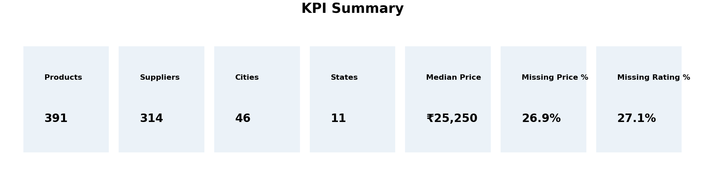

# B2B Data Pipeline – IndiaMART  
End-to-End Data Engineering & Exploratory Analysis (Slooze Take-Home Challenge)

This repository contains an end-to-end B2B data engineering pipeline built as part of the **Slooze take-home challenge**:

**IndiaMART Web Scraping → ETL → Exploratory Data Analysis (10 Charts) → Local Django Dashboard**

The project demonstrates practical data collection, cleaning, analysis, and visualization, with an emphasis on robustness, reproducibility, and business-oriented insights.

---

## 🚀 Overview

### Part A — Data Collection (IndiaMART)
- Scrapes product listings across multiple keywords/categories
- Implements retry with backoff and polite rate-limiting to reduce blocking
- Produces structured outputs in CSV (with optional SQLite artifacts)
- Designed to be configurable and restartable (checkpoint support)

### Part B — Exploratory Data Analysis (EDA)
- Cleans and standardizes scraped data (price parsing, bucketing, regions)
- Generates **exactly 10 professional charts** saved to `/plots`
- Produces tabular reports in `/reports` and qualitative insights in `EDA_INSIGHTS.md`

### Dashboard (Bonus)
- Local Django dashboard to explore KPIs, charts, and a data table
- Uses `clean_data.csv` generated by the ETL step as its primary data source
- Intended as a lightweight visualization layer (not production hosting)

---

## 📁 Project Structure

.
├── scraper.py # IndiaMART data collector
├── etl.py # Cleaning + transformation + schema enforcement
├── analysis.py # EDA + generation of exactly 10 charts
├── main.py # End-to-end runner (ETL + EDA)
├── clean_data.csv # Cleaned dataset
├── plots/ # Generated chart images (10 total)
├── reports/ # Summary CSV reports
├── EDA_INSIGHTS.md # Qualitative insights
├── dashboard/ # Django app (local dashboard)
└── requirements.txt


---

## ⚙️ Setup

```bash
python -m venv venv

# Windows
venv\Scripts\activate

# macOS / Linux
# source venv/bin/activate

pip install -r requirements.txt
▶️ Run
Run full pipeline (ETL + EDA)
python main.py
Run EDA only (regenerates charts + reports)
python analysis.py
Run Django dashboard (local)
cd dashboard
python manage.py runserver
Then open:

http://127.0.0.1:8000/

📊 Outputs
Charts (Exactly 10)
Saved in /plots:

KPI Cards

Line Chart

Bar Chart

Donut Chart

Histogram (Price Distribution)

Map Approximation (City Index)

Combo Chart (Bar + Line)

Treemap

Waterfall Chart

Scatter Plot

Reports
Saved in /reports:

Dataset summary statistics

Missingness & data quality checks

Outlier listings

Top product keyword/token frequencies

🧾 Data Quality Summary
A brief summary (full details available in EDA_INSIGHTS.md and /reports):

~27% of listings have missing price (many sellers do not publish prices publicly)

~27% of listings have missing ratings

Duplicate suppliers/products are handled via ID + name normalization

High price outliers are flagged (not dropped) to preserve industrial/bulk listings

Price values are parsed into numeric form and bucketed (Low / Mid / High / Unknown)

Location fields are standardized into city, state, and supplier region

Some records contain incomplete metadata due to marketplace UI constraints

Limitations
Certain sellers intentionally hide prices or ratings

Results may reflect sampling bias from chosen keywords and marketplace personalization

Location data quality depends on seller-provided information

🧠 Analytical Hypotheses
Exploratory observations based on this dataset:

The South region appears to dominate listings, which may indicate sampling bias from selected keywords or IndiaMART search personalization.

A large “Unknown” price bucket suggests that price visibility may correlate with seller tier or product category.

Extreme price outliers likely represent bulk or industrial orders; downstream dashboards may benefit from optional outlier capping for visualization clarity.

🗄️ Database Artifacts
This repository currently includes:

products.db

dashboard/db.sqlite3

These SQLite files are generated artifacts and are included only for quick local demo and inspection.
In a production workflow, these would typically be excluded and regenerated from the pipeline.

🛡️ Git Ignore Recommendations
If you prefer not to version generated artifacts locally, consider adding the following to .gitignore:

*.db
__pycache__/
*.pyc
.env
venv/
(If keeping databases for demo purposes, do not ignore *.db.)

📸 Dashboard Preview
You can embed screenshots here, for example:

## Dashboard Preview

Optionally place UI screenshots in a /screenshots folder and reference them.

📬 Contact
Kathir Ranjanaa S
Email: kathirranjanaas@gmail.com
Phone: +91 9345512491
GitHub: https://github.com/Kathirranjanaa
LinkedIn: https://www.linkedin.com/in/kathir-ranjanaa-s/

Slooze submission: careers@slooze.xyz


---

# ✅ Step 2 — Update `.gitignore`

Open `.gitignore` and append this at the bottom:

*.db
pycache/
*.pyc
.env
venv/


(If you want to keep DBs tracked, remove `*.db`.)

---

# ✅ Step 3 — Commit README + .gitignore

Run:

```powershell
git add README.md .gitignore
git commit -m "Improve README and gitignore for professional submission"
git push
