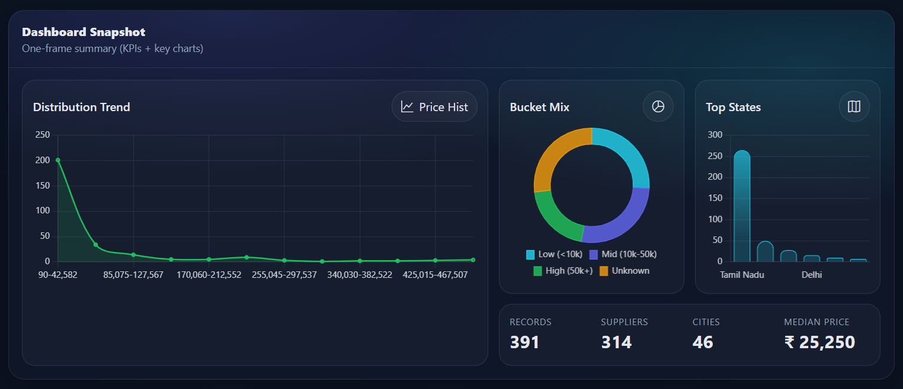
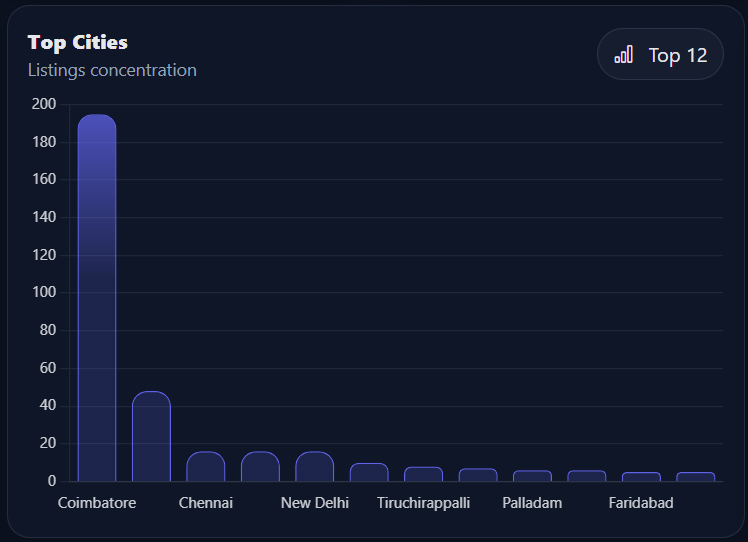

# 📊 B2B Data Pipeline & Professional Analytics Dashboard

An end-to-end **B2B Data Engineering and Analytics Pipeline** that automates web data extraction, performs structured data cleaning, and generates **industry-grade visualizations** for business insights.  
This project demonstrates real-world practices in **web scraping, data processing, analytics, and dashboard-ready reporting**.

The system follows a complete workflow:

> Scrape → Clean → Analyze → Visualize → Export (Dashboard Ready)

Built with scalability and professional reporting in mind.

---

## 🚀 Project Overview

This project focuses on building a **production-style data pipeline** for B2B product and supplier analytics.

### Key Capabilities

- Automated data collection using Selenium  
- Structured data cleaning and preprocessing  
- KPI generation for business decision-making  
- Creation of exactly 10 professional charts  
- Export of charts as PNG + Base64 (Django/dashboard ready)  
- Optimized for large datasets (fast + stable Matplotlib backend)  

The output can be directly integrated into dashboards or web applications.

---

## 🧩 Problem Statement

Businesses often lack structured insights from unorganized B2B web data.  
Manual collection and analysis is slow, error-prone, and not scalable.

This project solves that problem by building an automated pipeline that:
- Collects B2B product data  
- Cleans and standardizes it  
- Produces business-ready analytics  
- Generates dashboard-grade visualizations  

---

## 🏗️ Architecture


B2B_Data_Pipeline/
│
├── crawler.py          # Selenium web scraping
├── clean_data.csv     # Cleaned dataset
├── analysis.py        # Analytics + visualization engine
├── plots/             # Generated professional charts (PNG)
├── requirements.txt  # Project dependencies
└── README.md

---

## 🔄 Data Pipeline Flow

### 1. Web Scraping
- Extracts B2B product and supplier data using Selenium.

### 2. Data Cleaning
- Removes nulls & duplicates  
- Standardizes city/state fields  
- Converts prices to numeric  
- Creates price buckets  
- Prepares analytics-ready CSV  

### 3. Analytics & Visualization
- Computes KPIs  
- Generates exactly 10 professional charts  
- Saves charts for dashboard usage  

---

## 📈 Visualizations Generated (Exactly 10)

1. KPI Scorecards  
2. Line Chart – Trend Analysis  
3. Bar Chart – Products by City  
4. Bar Chart – Products by State  
5. Donut Chart – Price Bucket Distribution  
6. Histogram – Price Distribution  
7. Map Approximation – Geographic Spread  
8. Combo Chart – Bar + Line Comparison  
9. Treemap – Category Contribution  
10. Scatter Plot – Price vs Rating  

These charts follow industry dashboard standards and are optimized for performance.

---

## 🧰 Tech Stack

- Python  
- Selenium – Web automation & scraping  
- Pandas / NumPy – Data processing  
- Matplotlib – Professional visualization  
- ChromeDriver  
- CSV Pipeline  
- Dashboard-ready export (Base64 compatible with Django)  

---

## ⚙️ Installation & Setup

### 1️⃣ Clone Repository

```bash
git clone https://github.com/yourusername/B2B_Data_Pipeline.git
cd B2B_Data_Pipeline

### 2️⃣ Install Dependencies

```bash
pip install -r requirements.txt

### 3️⃣ Run Web Scraper

```bash
python crawler.py


This generates raw data.

### 4️⃣ Run Analytics Pipeline

```bash
python analysis.py

Outputs:
- `clean_data.csv`
- 10 professional PNG charts inside `/plots`

---

## 🖼️ Sample Dashboard Outputs

### Dashboard Snapshot – KPIs & Key Charts


### Top Cities – Listings Concentration


These screenshots showcase:
- KPI summary (records, suppliers, cities, median price)
- Price distribution trend
- Bucket mix (Low / Mid / High)
- Top states
- Top cities concentration

They demonstrate the dashboard-ready analytics generated from the pipeline.


---

## 📌 Project Metrics

- Dataset Size: 300+ records  
- Charts Generated: 10  
- Pipeline Stages: 4  
- Automation Level: Fully automated  

---

## 📚 Key Learnings

- Built an end-to-end data pipeline using Python  
- Implemented Selenium-based web automation  
- Performed real-world data cleaning and preprocessing  
- Designed professional analytics visualizations  
- Optimized Matplotlib for large datasets  
- Prepared outputs for dashboard integration  
- Applied business thinking to technical analytics  

---

## 📊 Business Use Cases

- Market strength identification by city/state  
- Supplier region performance analysis  
- Pricing distribution insights  
- Product trend monitoring  
- Dashboard integration for management reporting  
- Decision support for B2B expansion strategies  

---

## 🎯 Project Highlights

✅ End-to-end data pipeline  
✅ Dashboard-ready exports  
✅ Handles large datasets safely  
✅ Real business applicability  

---

## 👨‍💻 Author

**Kathir Ranjanaa S.**  

- GitHub: https://github.com/Kathirranjanaa  
- LinkedIn: https://www.linkedin.com/in/kathir-ranjanaa-s/
